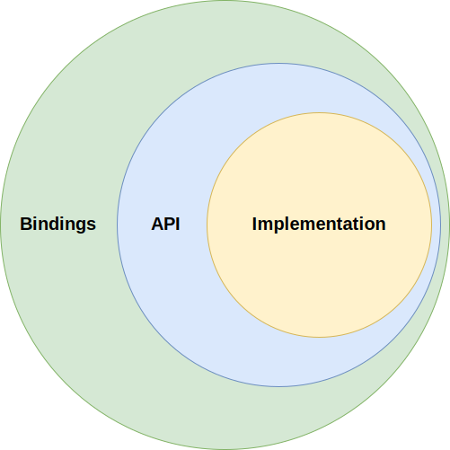

Design
======

Overview
--------

There are many existing users and solutions that need to capture the state of a list of RPM packages to a serialized file. Common scenarios include recording the current state of installed packages on a system, describing all dependencies required for the installation of a specific package, or detailing which packages make up a specific image layer in containerized systems.

The serialized file should fully identify the packages to support use cases such as reproducible builds and Software Bill of Materials (SBOM) generation.

To address these needs, this library was created to provide a standardized mechanism for serializing metadata about RPM packages into **manifest** files and parsing them back into structured objects. The intent is to create a library that is simple to use, maintains backward compatibility in its API, and supports evolving backend technologies without impacting the user-facing interface.

Use Cases
---------

The library is designed to cater to a diverse range of users with varying intentions. It aims to remain generic enough to provide the core functionality needed by all clients.

Below are several expected use cases for applications utilizing this library:

- **Generate a manifest file**
    - Create a manifest file containing metadata for a list of packages.

- **Download package payloads**
    - Download the payloads of packages listed in the manifest file without needing external data.

- **Install packages**
    - Download and install packages using a Linux package manager via a C++ or Python API based on the metadata in the manifest file.

- **Identify package origins**
    - Fully identify the origin of individual packages based on the manifest file, distinguishing instances of the same package NEVRA from different repositories or mirrors.

- **Manipulate manifest objects**
    - Work with manifest objects in a object-oriented way within the client application.

Requirements
------------

This section outlines the necessary functional and non-functional requirements for the library to ensure it meets the needs of client applications.

Functional Requirements
~~~~~~~~~~~~~~~~~~~~~~~

Manifest Generation
^^^^^^^^^^^^^^^^^^^

The library shall provide an API to create manifest files containing essential metadata fields for each package, including:

- Package Name, Version, Release, Architecture (NEVRA)
- Checksum for verifying package integrity
- Name of the corresponding source RPM if requested

Manifest files shall be generated in YAML format, adhering to a predefined schema for consistency and validated upon creation. Validation errors shall result in structured feedback to the user, either as exceptions or error codes, depending on the client environment.

The API shall support both generating new manifest files and updating existing ones.

Package Payload Downloading
^^^^^^^^^^^^^^^^^^^^^^^^^^^

The manifest file shall provide sufficient information to download payloads of specified packages using either a direct URL or through repository metalinks compatible with a package manager.

Object-Oriented Manifest Manipulation
^^^^^^^^^^^^^^^^^^^^^^^^^^^^^^^^^^^^^

The library shall support object-oriented manipulation of manifest objects, with operations including create, read, update, and delete.

A flexible, well-documented API shall be provided to enable developers to interact with manifest data programmatically.

The API shall enforce constraints on data types and required fields to maintain manifest consistency. Invalid operations or mismatched data types will result in structured error feedback, such as exceptions, ensuring data integrity and ease of troubleshooting.

Non-Functional Requirements
~~~~~~~~~~~~~~~~~~~~~~~~~~~

Portability
^^^^^^^^^^^

The library shall be designed to be compilable on major Linux distributions, ensuring compatibility with popular environments, primarily Fedora and Ubuntu. All dependencies shall be readily available on these distributions through standard package managers.

The API shall be available in both C++ and Python, ensuring seamless integration for applications written in either language. Python support shall be compatible with Python 3.7 and later to align with widely used Python versions.

Library Design
^^^^^^^^^^^^^^

The API shall be intuitive, well-documented, and easy to use, supporting various client needs across different use cases.

The library design shall allow for the addition of new metadata fields in manifest files without breaking existing functionality or requiring changes to client code. Backward and forward ABI (Application Binary Interface) compatibility shall be maintained to ensure smooth upgrades and integration with existing systems.

The backend technologies used in the library should be modular and swappable, allowing for future changes or replacements of these technologies without affecting the end user’s experience. Clients should not need to modify their applications when such backend changes are made.

Architecture and Design Considerations
--------------------------------------

The library follows an **onion architecture**, where each layer has a distinct role, forming a clear separation of concerns:

Implementation
~~~~~~~~~~~~~~

- Developed using Test-Driven Development (TDD) to ensure robustness and maintainability
- This layer forms the core logic which provides the essential functionalities that are leveraged by higher-level components

API
~~~

- Serves as the public interface for the library
- Designed to provide an **ABI-compatible** interface to support future extensions and interoperability
- This layer wraps the underlying implementation objects to expose a consistent and safe public interface
- Each API object essentialy acts as a proxy, forwarding calls to the corresponding implementation object that it encapsulates

Bindings
~~~~~~~~

- Automatically generated Python API using the **SWIG** library, based on the existing C++ public API
- This layer enables the use of the library in other languages by generating language-specific wrappers for the C++ API

Tests
~~~~~

- Comprises comprehensive test suites for:
  - The implementation layer (TDD-driven)
  - The API layer to ensure the public API adheres to its defined contract
  - The bindings layer to validate cross-language compatibility

The overall structure ensures that the core logic is decoupled from the public API, enabling flexible API design and easy integration of additional bindings. This separation also allows the testing strategy to be applied at multiple levels, ensuring high coverage and reliability.

High-Level Architecture Diagram
~~~~~~~~~~~~~~~~~~~~~~~~~~~~~~~

API
^^^

The diagram below illustrates the relationships between all objects exposed in the public user interface.

At the top, two operational classes, `Parser` and `Serializer`, are used to handle the `Manifest` object and its subcomponents.

Below them are the various objects that make up the manifest, corresponding to their structure in the file.

.. image:: img/arch-api.svg
   :alt: Architecture of API classes
   :align: center

Implementation
^^^^^^^^^^^^^^

The diagram below details a specific implementation of the `Version` object, along with all the classes required for its use in the operational classes mentioned above. Other manifest objects follow the same pattern.

The purpose of each class should be self-explanatory and is outlined as follows:

- **Factory:** Creates an empty instance of a specific manifest object.
- **Parser:** Handles parsing the object from a data node.
- **Serializer:** Manages serializing the object into a data node.
- **YamlNode:** Provides the backend interface for processing YAML data nodes.

.. image:: img/arch-impl.svg
   :alt: Architecture of Impl classes
   :align: center

Data Flow
~~~~~~~~~

The data flow in this library is managed through a series of interconnected classes, each adhering to the Single Responsibility Principle (SRP).

The attached diagram illustrates the parsing of the manifest file and the overall flow of data through the library, highlighting the modular structure resulting from TDD practices.

.. image:: img/seq-parser.svg
   :alt: Sequence diagram of parsing the Manifest
   :align: center

Dependencies
------------

Here is the list of dependencies used in the project:

- `yaml-cpp <https://github.com/jbeder/yaml-cpp>`_
   - YAML document parser and serializer.

- `SWIG <https://github.com/swig/swig>`_
   - Generator of high-level programming language APIs.
   - *(Only needed when building with Python bindings.)*

- `GoogleTest <https://github.com/google/googletest>`_
   - Google's C++ testing framework.
   - *(Only needed when building with tests.)*
